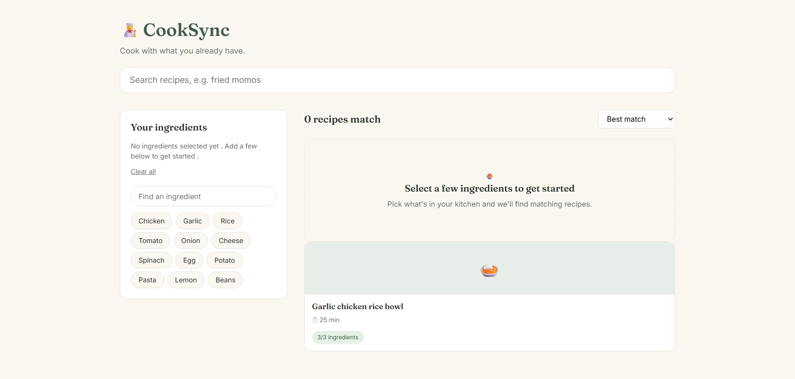

🧑‍🍳 CookSync

A web app that lets you select ingredients you already have in your kitchen and instantly see which recipes you can make  -  ranked by how closely each one matches what's in you cooksync . Search by name , sort by best match/ fastest to cook / A-Z , and click into any recipe for full ingredients and step by step instructions.

Live demo :<a href = https://prathamesh-2723.github.io/Recipe-Finder/>Recipe-Finder </a>

Features:
<ul> <li><strong>Ingredient-based filtering</strong> — click ingredient chips to see only recipes you can actually make with what you have</li> <li><strong>Match percentage</strong> — each recipe shows how many of its ingredients you already have (e.g. "3/3 ingredients")</li> <li><strong>Text search</strong> — find a recipe directly by name</li> <li><strong>Sorting</strong> — sort results by best match, fastest to cook, or alphabetically</li> <li><strong>Recipe detail view</strong> — click any recipe card to see the full ingredient list (with owned vs. missing ingredients highlighted) and step-by-step instructions</li> <li><strong>Empty/no-results states</strong> — helpful messaging when no ingredients are selected or nothing matches</li> </ul>

<h2>Tech Stack</h2> <ul> <li>Vanilla HTML, CSS, and JavaScript — no frameworks or libraries</li> <li>DOM manipulation and event handling done from scratch</li> <li>Data currently hardcoded in <code>script.js</code>; structured so it can be swapped for a real API (e.g. <a href="https://www.themealdb.com/api.php">TheMealDB</a>) later</li> </ul> <h2>What I Learned</h2> <ul> <li><strong>DOM manipulation from scratch</strong> — dynamically creating elements (<code>createElement</code>, <code>appendChild</code>) instead of relying on static HTML, so the UI can render any number of results at runtime</li> <li><strong>State management without a framework</strong> — keeping a <code>selectedIngredients</code> array as the single source of truth and re-rendering the UI whenever it changes</li> <li><strong>Array methods for real logic</strong> — combining <code>filter()</code>, <code>map()</code>, <code>sort()</code>, and <code>reduce()</code> to compute match ratios and rank recipes</li> <li><strong>Event handling patterns</strong> — toggling selections on click, debouncing input, avoiding duplicate listeners</li> <li><strong>Debugging real bugs</strong> — scoping issues (variable shadowing in loops), property vs. method mistakes (<code>className</code> isn't a function), and why reusing a single static DOM node breaks when rendering a list</li> </ul>
<h2>Possible Future Improvements</h2> <ul> <li>Replace hardcoded recipe data with a live API (TheMealDB or similar)</li> <li>Persist selected ingredients in <code>localStorage</code> so they survive a page refresh</li> <li>Add dietary filters (vegetarian, gluten-free, etc.)</li> <li>Mobile-responsive polish and accessibility pass</li> </ul>